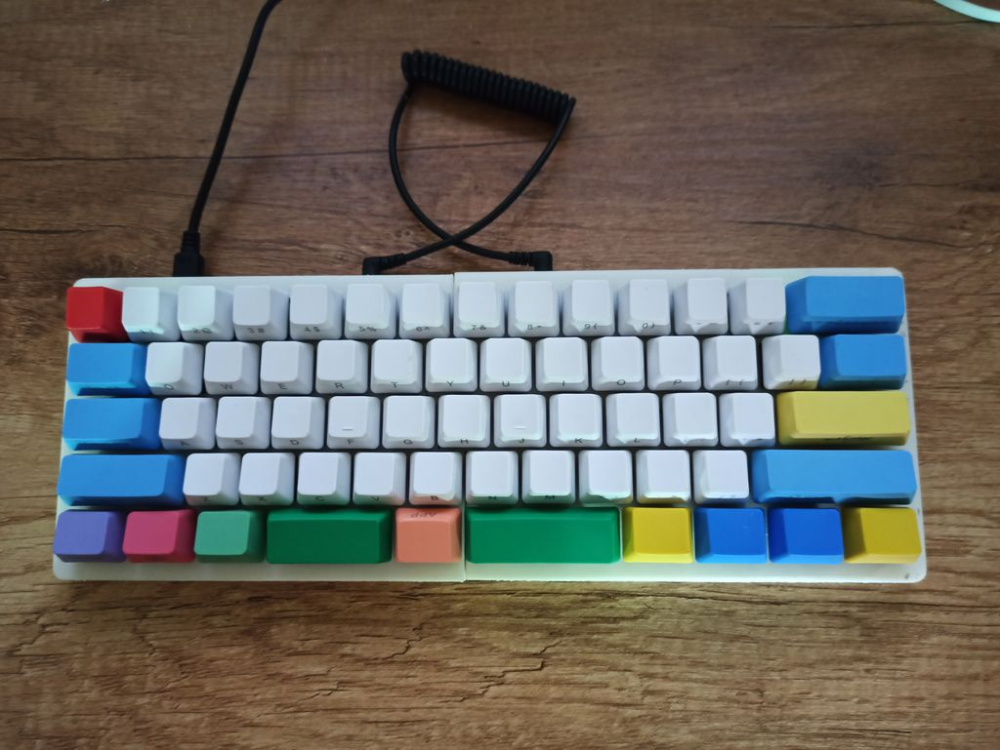
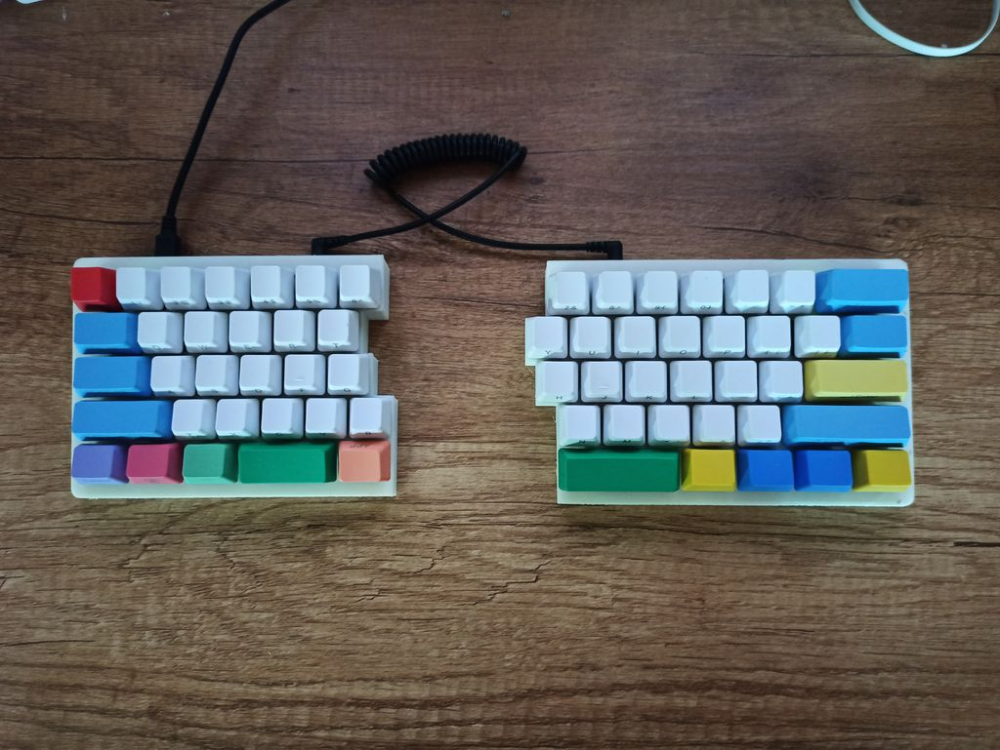
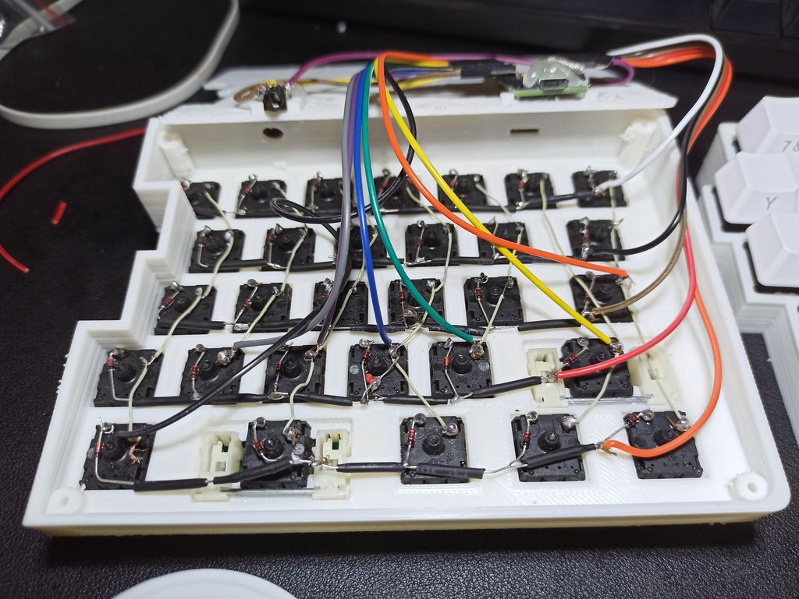
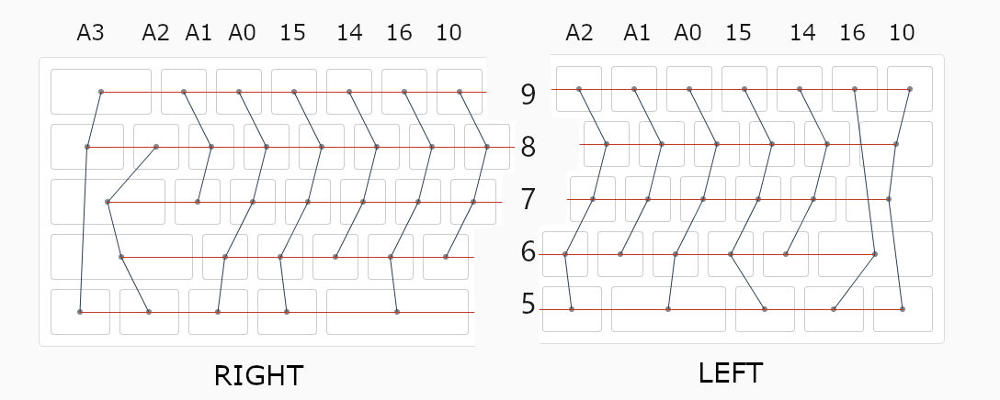

# ks63

A handwired 63 keys split keyboard compatible with Default 60% layout. Let you keep your magic power while muggles can still use it as an ordinary keyboard

# Assembly

## 3D Printing

Case files in `stl` folder were parameterized in upside down orientation, it takes shorter time to print, but may not be able to lay flat due to material warpping, you may need to sand them down a little bit.

If you want to try out printing cases in natural orientation, checkout my [klesh/f360-split-keyboard-case-generator](https://github.com/klesh/f360-split-keyboard-case-generator) project, tweak parameters in `libs/config.py` to your need, espicially the `HOLE_SIZE` parameter. 

## Wiring

### Wiring up matrices, one ProMicro for each part:

### Wiring up 2 ProMicros:

for more information, please checkout [QMK documentation about split keyboard](https://docs.qmk.fm/#/feature_split_keyboard)

## Firmware

### Flashing prebuilt firmware

1. Download [QMK Toolbox](https://github.com/qmk/qmk_toolbox/releases/latest)
2. Select firmware file [firmware\handwired_ks63_default.hex](firmware\handwired_ks63_default.hex), and check the auto-flash
3. Reset ProMicro by shorting `RST` pin to `GND` pin

### Customize your own keymap

1. Prepare building environment by following [QMK setup tutorial](https://docs.qmk.fm/#/newbs_getting_started)
2. Copy `qmk/ks63` folder to your local `qmk_firmware/keyboards/handwired` as a subfolder
3. Edit `ks63/keymaps/default/keymap.c` file according to [QMK Full Keycode List](https://docs.qmk.fm/#/keycodes)
4. Compile your firmware by `qmk compile -kb handwired/ks63 -km default`
5. A new firmware should be presented at your `qmk_firmware` folder

